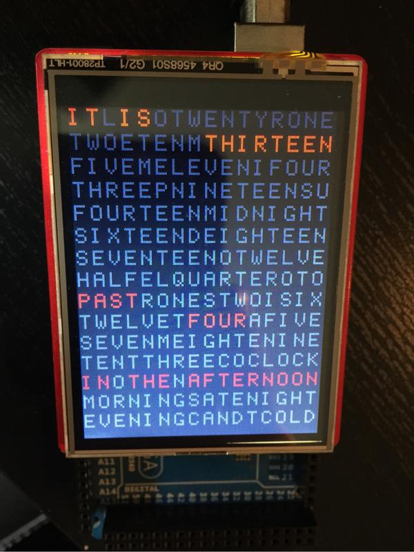

# wordclock

Parts used for this project:
* Arduino Mega 2560
* SeeedStudio 2.8" TFT Touch Shield 

Thanks @wouterdevinck for sharing the source for their [wordclock build](https://github.com/wouterdevinck/wordclock).
